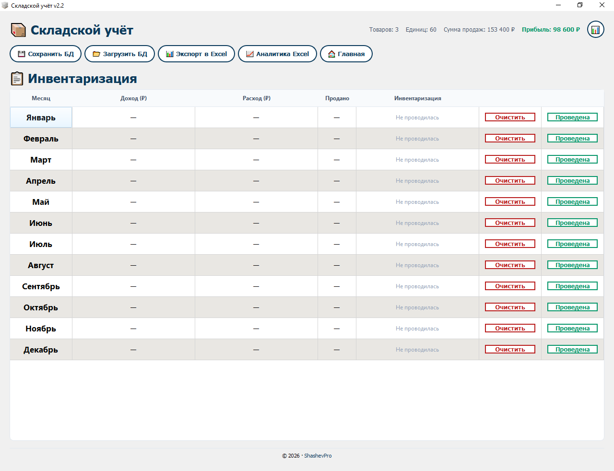
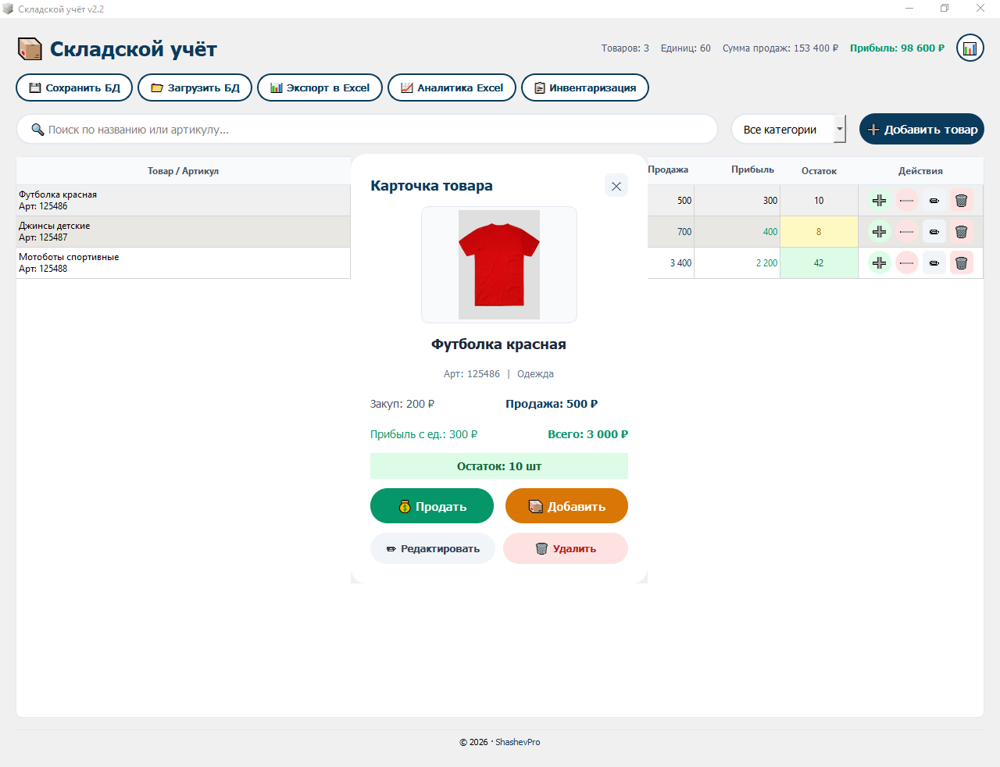

# 📦 Складской учёт v2.2

Простой контроль товаров и прибыли в одной программе!

Устали от таблиц Excel, путаницы с остатками и ручного подсчёта прибыли? **Складской учёт v2.2** — это удобная программа для компьютера, которая помогает быстро вести учёт товаров, продаж и остатков без сложных настроек и без интернета.

> 💻 Всё работает локально — без облаков, подписок и слежки.
> Скачал → запустил → работаешь.

---

## 🔥 Возможности программы

- ✅ Добавление товаров с фото
- ✅ Учёт закупок и продаж
- ✅ Автоматический расчёт прибыли
- ✅ Цветовая индикация остатков
- ✅ Поиск по названию и артикулу
- ✅ Фильтрация по категориям
- ✅ PDF отчёты и аналитика
- ✅ Графики движения товаров
- ✅ Резервные копии базы данных
- ✅ Удобный и понятный интерфейс

---

## 🖥️ Скриншоты

### Список товаров

### Карточка товара

### Инвентаризация

---

## 📊 Для кого подойдёт

- Магазины
- Домашний бизнес
- Мастерские
- Производство
- Торговля через соцсети
- Учёт товаров на складе

---

## ⚡ Основная идея

Максимум простоты. Никаких сложных CRM и перегруженных систем — все функции под рукой и понятны даже новичку.

**Системные требования:** Windows 10, 11

🔒 Ваши данные хранятся только у вас на компьютере.

---

## 💰 Это коммерческий продукт

Данный репозиторий носит презентационный характер — исходный код программы закрыт, так как это коммерческий продукт.

Приобрести программу можно здесь:

- 🌐 Сайт: [shashevpro.ru](https://shashevpro.ru)
- 🛒 Kwork: [kwork.ru/user/shashevpro](https://kwork.ru/user/shashevpro)
- ✉️ Email: programmer@shashevpro.ru
- 💬 VK: [vk.com/shashevpro](https://vk.com/shashevpro)

---

© 2026 ShashevPro. Все права защищены. Программа распространяется на коммерческой основе.
